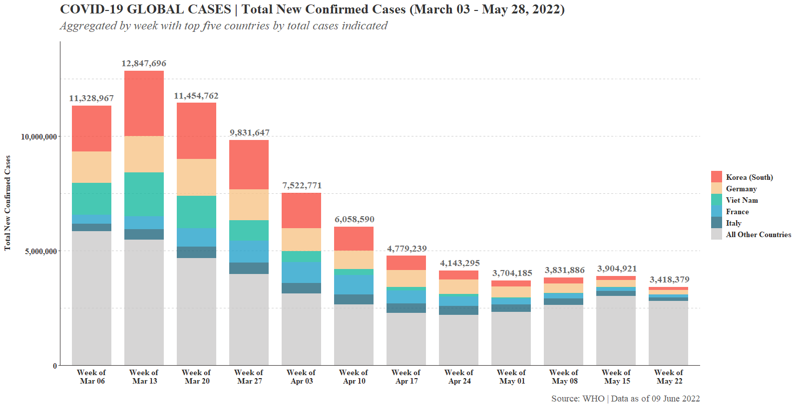

# COVID-19 | Visualizing the Top 5 Countries for Weekly Global Case Counts

As the COVID-19 pandemic unfolded, stakeholders in the public health world often wanted a clear understanding of what countries were driving the surges and declines in global case counts. This component of situational awareness was (and still is) critical for sound decision making regarding resources and personnel related to pandemic management, not to mention health care system capacity and mitigation measures.

To meet this need, I created an R function that takes just two arguments (a start and end date) and then uses raw case count data to produce a visually elegant bar graph that shows weekly global case counts with the top five countries (in terms of cumulative total case counts for the time span) inicated by separate colors.  

These graphs could be central for use in situation reports, slide decks, and other rapid-response documents that underpin high-quality decision making during a pandemic.

